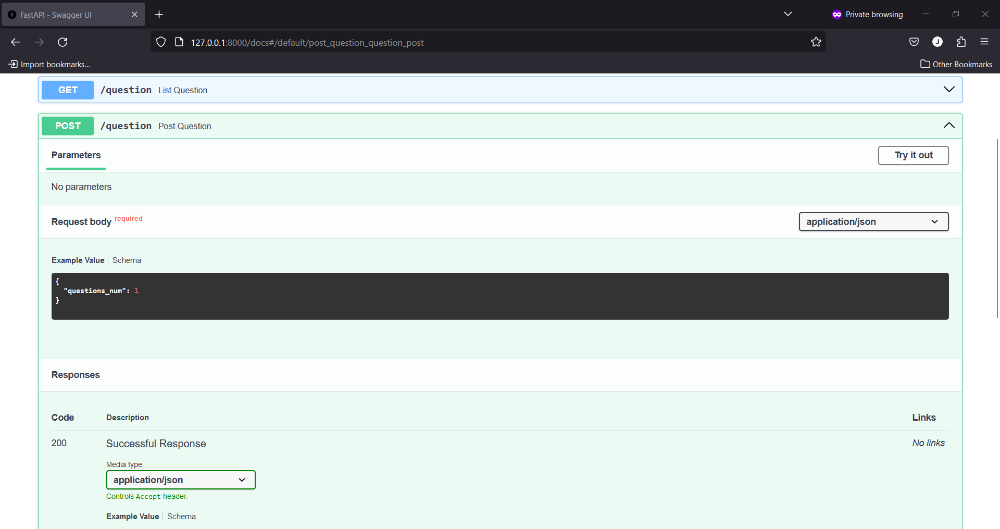
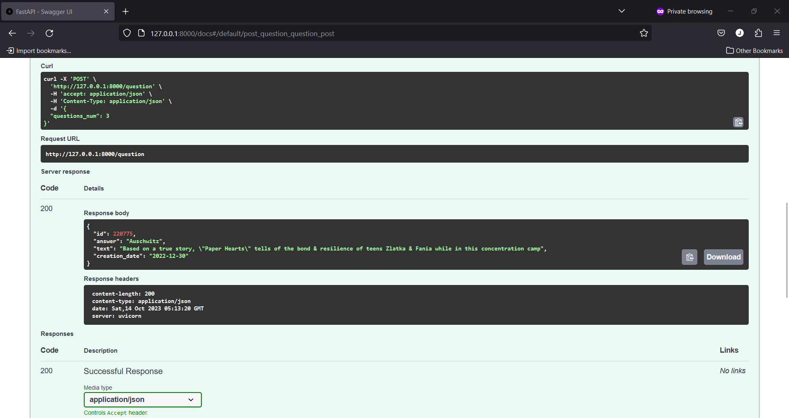

# Running with Docker Compose

If you have Docker Compose installed, you can run RestarauntAPI using the provided `docker-compose.yml` file. Follow these steps:

1. Clone the RestarauntAPI repository from GitHub.
2. Install Docker and Docker Compose if you haven't already.
3. Create `.env` file in root derictory or just rename `.env.example` file to `.env`.
4. Build Docker Compose containers using `docker-compose build`
5. Start the services using Docker Compose: `docker-compose up -d`
6. Access API in your web browser at http://127.0.0.1:8000/docs

# API Use Case 

Open http://127.0.0.1:8000/docs in your web browser and expand `POST /question` menu:

Press `Try it out` button:

In request body field specify ho many questions do you need and press `Execute` button:

Check result of the request:

Also you can view all Questions in DB using `GET /question`:

Press `Try it out` button, after press `Execute` button and watch results:
